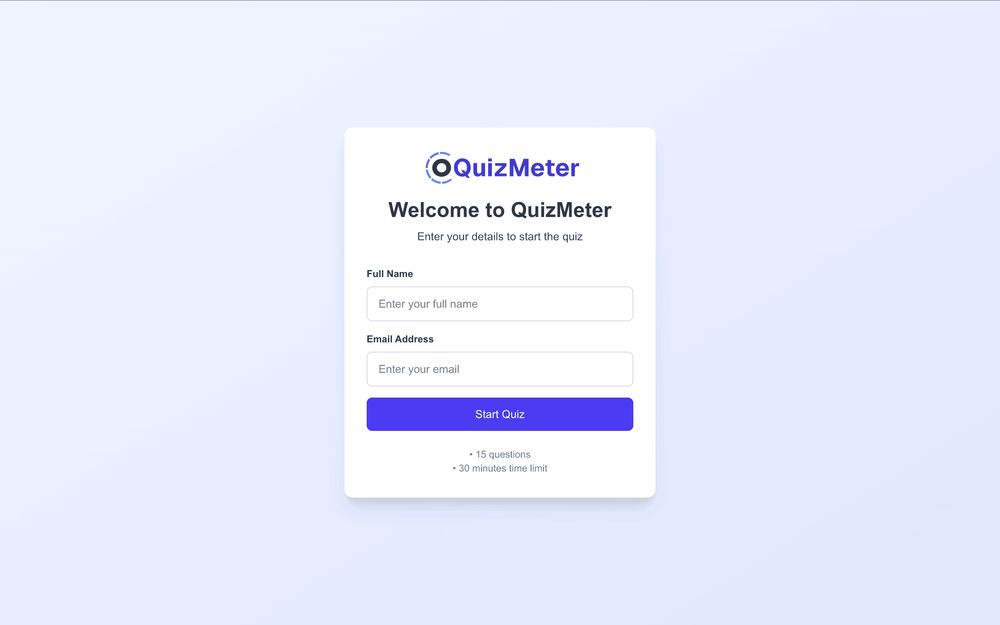
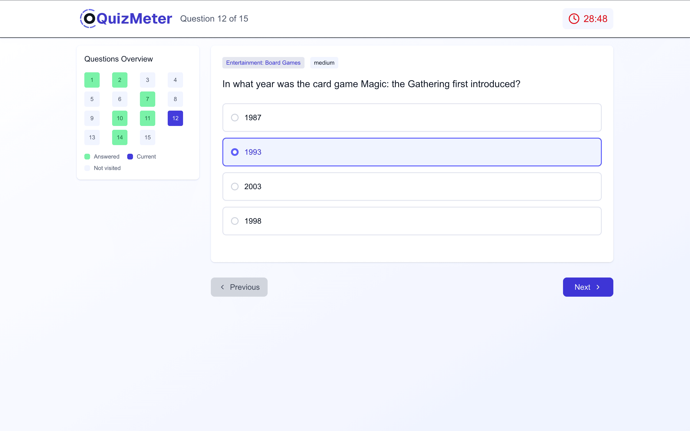
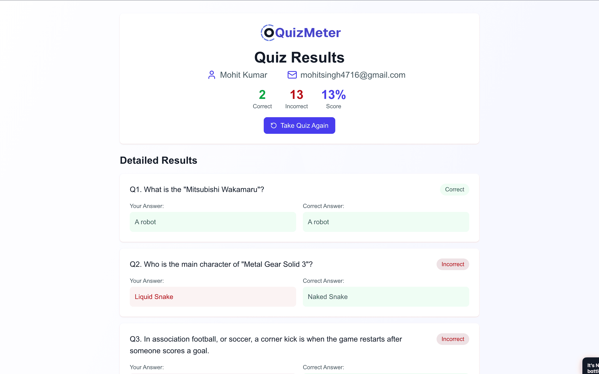

<div align="center">
  <h1>🎯 Quiz Meter</h1>
  <p><strong>Interactive Quiz Application with Real-time Timer & Detailed Analytics</strong></p>
  
  
  
  
  
</div>

---


##  Demo

> **Live Demo:** [quiz-meter.vercel.app](https://quiz-meter.vercel.app)

Experience the full-featured quiz application with real-time timer, dynamic question fetching, and comprehensive result analytics.

---

## ✨ Features

<table>
  <tr>
    <td>
      <h3>🔐 User Authentication</h3>
      <ul>
        <li>Email validation & registration</li>
        <li>User session management</li>
        <li>Persistent user data</li>
      </ul>
    </td>
    <td>
      <h3>📚 Dynamic Quiz System</h3>
      <ul>
        <li>15 multiple-choice questions</li>
        <li>Real-time API integration</li>
        <li>Question shuffling & randomization</li>
      </ul>
    </td>
  </tr>
  <tr>
    <td>
      <h3>⏱️ Advanced Timer</h3>
      <ul>
        <li>30-minute countdown timer</li>
        <li>Auto-submission on timeout</li>
        <li>Visual timer indicators</li>
      </ul>
    </td>
    <td>
      <h3>🎯 Smart Navigation</h3>
      <ul>
        <li>Free navigation between questions</li>
        <li>Progress tracking indicators</li>
        <li>Answer state persistence</li>
      </ul>
    </td>
  </tr>
  <tr>
    <td>
      <h3>📊 Comprehensive Reports</h3>
      <ul>
        <li>Detailed score breakdown</li>
        <li>Answer vs. correct comparison</li>
        <li>Performance analytics</li>
      </ul>
    </td>
    <td>
      <h3>📱 Responsive Design</h3>
      <ul>
        <li>Mobile-first approach</li>
        <li>Tablet & desktop optimized</li>
        <li>Cross-browser compatibility</li>
      </ul>
    </td>
  </tr>
</table>

---

## 🚀 Tech Stack

<div align="center">

| Frontend | Styling | Language | API | Tools |
|----------|---------|----------|-----|-------|
|  |  |  |  |  |

</div>

### Core Technologies

- **[Next.js 15](https://nextjs.org/)** - React framework with App Router
- **[TypeScript](https://www.typescriptlang.org/)** - Type-safe JavaScript
- **[Tailwind CSS](https://tailwindcss.com/)** - Utility-first CSS framework
- **[Open Trivia Database](https://opentdb.com/)** - Question source API
- **[Lucide React](https://lucide.dev/)** - Beautiful icon library

---

## 📦 Installation


### Quick Start

```bash
# 1️⃣ Clone the repository
git clone https://github.com/mohitsingh4716/QuizMeter.git
cd quiz-meter

# 2️⃣ Install dependencies
npm install

# 3️⃣ Run development server
npm run dev

# 4️⃣ Open in browser
# Navigate to http://localhost:3000
```

### Build for Production

```bash
# Build the application
npm run build

# Start production server
npm start
```

---

## 🏗️ Project Structure

```
quiz-meter/
├── 📁 app/                          # Next.js App Router
│   ├── 📁 quiz/                     # Quiz page
│   ├── 📁 report/                   # Results page
│   ├── 📁 start/                    # Landing page
│   └── 📄 layout.tsx                # Root layout
├── 📁 components/                   # Reusable components
│   ├── 📄 QuestionCard.tsx          # Question display
│   ├── 📄 QuestionOverview.tsx      # Progress sidebar
│   ├── 📄 Timer.tsx                 # Countdown timer
│   ├── 📄 ResultSummary.tsx         # Score summary
│   ├── 📄 ResultCard.tsx            # Answer comparison
│   └── 📄 NavigationButtons.tsx     # Quiz navigation
├── 📁 lib/                          # Utilities & types
│   └── 📄 types.ts                  # TypeScript definitions
├── 📁 public/                       # Static assets
│   └── 🖼️ quiz-meter.svg            # App logo
└── 📄 README.md                     # Documentation
```

---

## 🎯 Usage

### 1. Start Quiz
- Enter your name and email
- Click "Start Quiz" to begin

### 2. Take Quiz
- Answer 15 multiple-choice questions
- Navigate freely between questions
- Monitor remaining time

### 3. View Results
- See your score and percentage
- Review correct vs. incorrect answers
- Restart for another attempt

---

## 🚧 Challenges & Solutions
<table>
  <tr>
    <th>Challenge</th>
    <th>Solution</th>
    <th>Impact</th>
  </tr>
  <tr>
    <td>⚡ State Management</td>
    <td>Used localStorage for persistence across pages</td>
    <td>✅ Seamless navigation</td>
  </tr>
  <tr>
    <td>📱 Responsive Design</td>
    <td>Mobile-first approach with Tailwind breakpoints</td>
    <td>✅ Universal compatibility</td>
  </tr>
  <tr>
    <td>🔄 Answer Deselection</td>
    <td>Toggle logic for option selection/deselection</td>
    <td>✅ Enhanced UX</td>
  </tr>
  <tr>
    <td>⏱️ Timer Accuracy</td>
    <td>Implemented proper cleanup in useEffect for timer</td>
    <td>✅ Prevents memory leaks</td>
  </tr>
  <tr>
    <td>🎲 Randomized Options</td>
    <td>Shuffled answers only once per question load</td>
    <td>✅ Fair quiz experience</td>
  </tr>
  <tr>
    <td>📊 Score Calculation</td>
    <td>Dynamic comparison of user answers with correct answers</td>
    <td>✅ Accurate results</td>
  </tr>
  <tr>
    <td>🔄 Quiz Progress</td>
    <td>Saved current question index in localStorage</td>
    <td>✅ Resume after refresh</td>
  </tr>
  <tr>
    <td>📝 Form Validation</td>
    <td>Real-time validation for name and email fields</td>
    <td>✅ Valid user data</td>
  </tr>
</table>


---

## 📱 Screenshots

### Start Page


### Quiz Page


### Result Page



---

## 🌐 Deployment

### Vercel (Recommended)

```bash
# Deploy to Vercel
npm i -g vercel
vercel --prod
```


---
